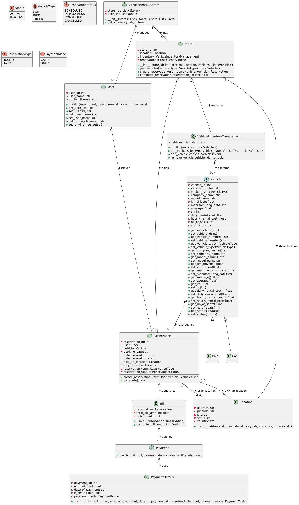

#Vehicle Rental System (LLD included)

A Python-based car & bike rental application demonstrating clean OOP principles and complete low-level design.

What’s inside:

LLD artifacts: UML class diagrams, sequence diagrams, design patterns

Core features: inventory management, reservation lifecycle, billing & payments

Extensible design: easy to add new vehicle types, billing rules, or a front-end

